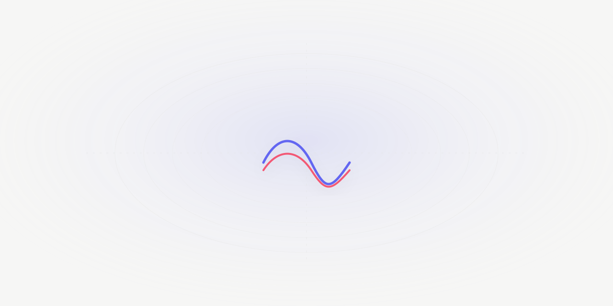
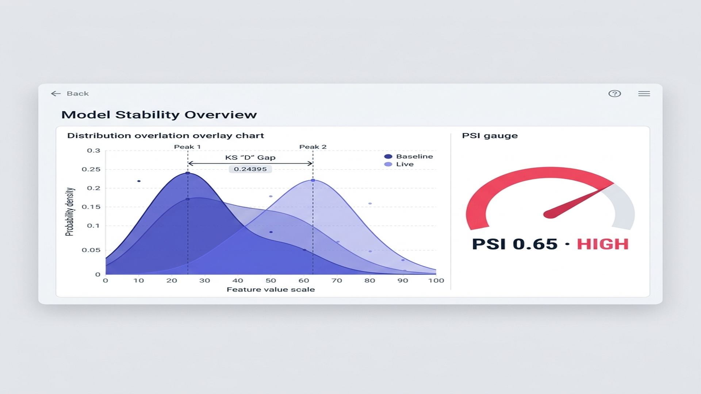
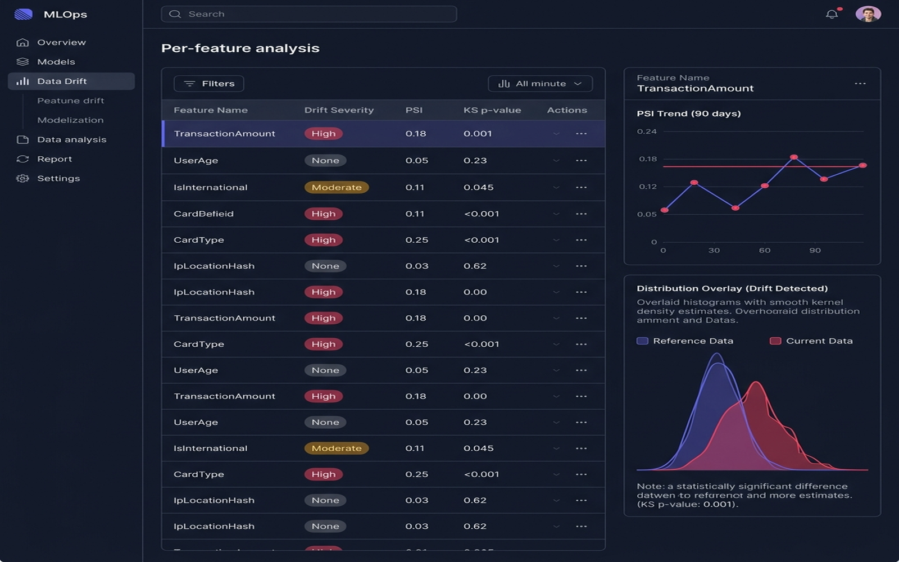
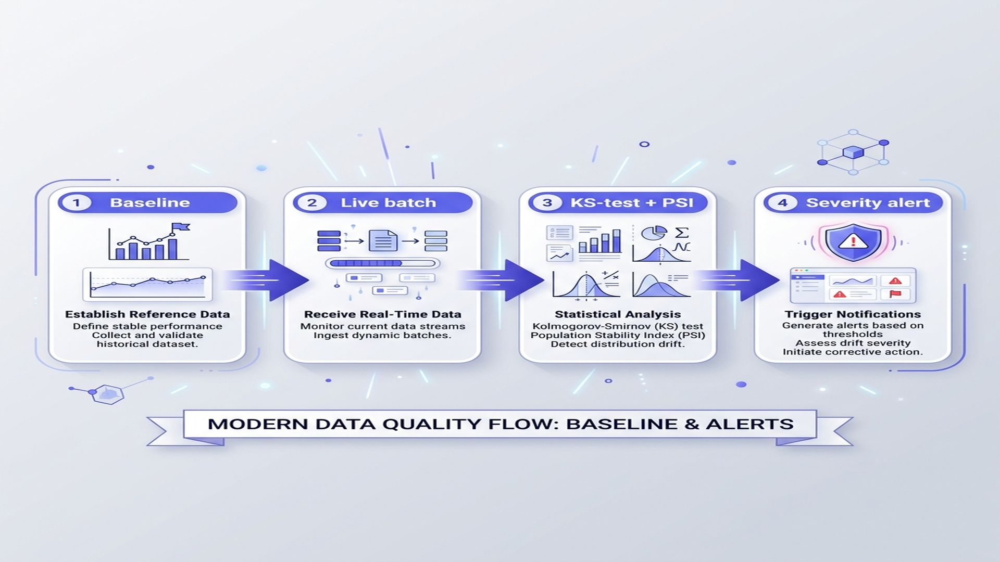
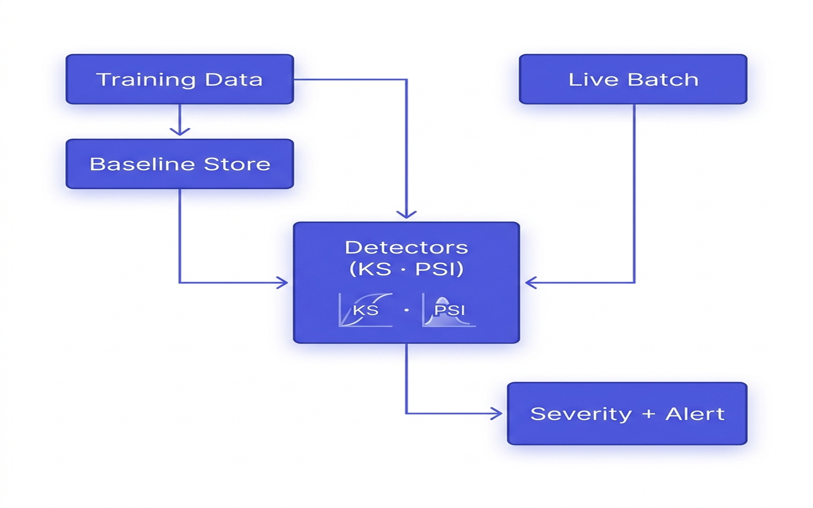
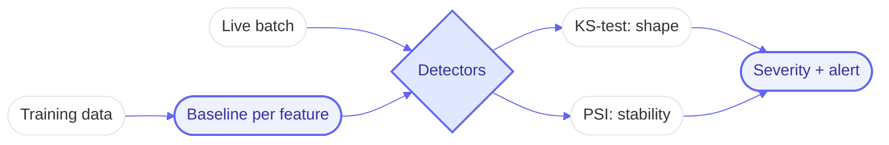

# DriftWatch Pro
### Statistical data-drift detection — catch when live data stops looking like your training data.




## 📖 Overview



Models rot silently when production data drifts away from the training distribution. DriftWatch Pro
registers a training **baseline** per feature, then scores each live batch with two complementary tests
and flags drift before accuracy quietly degrades:

- **Two-sample Kolmogorov–Smirnov (KS)** — detects a change in distribution shape (with an asymptotic p-value).
- **Population Stability Index (PSI)** — the standard MLOps drift metric on binned frequencies.

Both are implemented directly on numpy (no scipy), so the maths is auditable and the package is light.

> Part of my Senior Hybrid Engineer 2026 portfolio (`#48`). MLOps reliability under the Antigravity model —
> statistics run locally, cheaply, and explainably.

## 🚀 Quick Start
```bash
git clone https://github.com/Kimosabey/driftwatch-pro.git
cd driftwatch-pro
pip install -r requirements.txt

python -m unittest discover -s tests   # 10 tests
python -m driftwatch.demo              # baseline vs. stable / shifted / variance batches
docker compose up                      # HTTP API on :8000
```

### API
```bash
curl -s localhost:8000/baseline -H 'content-type: application/json' \
  -d '{"feature":"latency","values":[ ...training sample... ]}'

curl -s localhost:8000/check -H 'content-type: application/json' \
  -d '{"feature":"latency","values":[ ...live batch... ]}'
# -> {"feature":"latency","ks_stat":0.33,"p_value":0.0,"psi":0.65,"drifted":true,"severity":"high"}
```

### Demo output
```
batch           KS D   p-value     PSI  verdict
stable        0.0452    0.0645  0.0091  ok
mean-shift    0.3328    0.0000  0.6474  DRIFT (high)
variance      0.1372    0.0000  0.3340  DRIFT (high)
```

## ✨ Key Features



- **Two detectors** — KS-test (shape) + PSI (binned stability), so shifts one test misses the other catches.
- **Per-feature baselines** with a simple register-then-check API.
- **Severity grading** — `none` / `moderate` / `high` from p-value and PSI thresholds.



- **Adaptive binning** — PSI bin count scales to sample size, so small batches don't false-positive.
- **Dependency-light** — numpy only; tests run on the standard-library test runner.

## 🏗️ Architecture




The hard part is telling **real drift from sampling noise**: choosing tests and thresholds (and adapting
PSI bins to sample size) so alerts fire on signal, not variance. See [docs/ARCHITECTURE.md](./docs/ARCHITECTURE.md).

## 🧰 Tech Stack
| Layer | Technology | Role |
| :--- | :--- | :--- |
| Language | Python 3.12 | Detectors + monitor + API |
| Numerics | numpy | KS statistic, PSI, quantile binning |
| Transport | stdlib `http.server` | Zero-framework HTTP API |
| Tests | stdlib `unittest` | 10 deterministic tests |
| Container | Docker + Compose | One-command run |

## 📚 Documentation
- [Architecture](./docs/ARCHITECTURE.md) — detectors, thresholds, adaptive binning
- [Getting Started](./docs/GETTING_STARTED.md) · [Failure Scenarios](./docs/FAILURE_SCENARIOS.md) · [Interview Q&A](./docs/INTERVIEW_QA.md)

## 🔭 Future Enhancements
- Categorical-feature drift (chi-square)
- Rolling-window monitoring + alert history
- Auto-retrain trigger when severity stays high
- Grafana / Prometheus metrics export

## 📄 License
Released under the MIT License.

## 👤 Author

**Harshan Aiyappa**
Senior Full-Stack Hybrid AI Engineer
Voice AI • Distributed Systems • Infrastructure

[](https://kimo-nexus.vercel.app/)
[](https://github.com/Kimosabey)
[](https://linkedin.com/in/harshan-aiyappa)
[](https://x.com/HarshanAiyappa)
