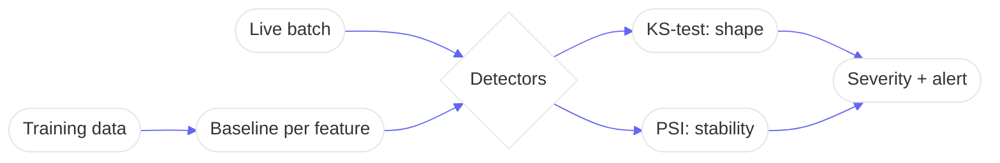

# Architecture — DriftWatch Pro

## High-Level Design (HLD)
DriftWatch Pro registers a **training baseline** per feature, then scores each live batch against it with
two complementary statistical tests and grades the drift severity — so a model's silent decay surfaces as
an explicit alert.

## Low-Level Design (LLD)
- **`detectors.py`**
  - `ks_2samp(baseline, live) -> (D, p)` — two-sample Kolmogorov–Smirnov via numpy: builds both ECDFs on
    the merged grid, takes the max gap `D`, and returns an asymptotic p-value (Kolmogorov series).
  - `psi(baseline, live, bins=10) -> float` — Population Stability Index over quantile bins, with
    **adaptive bin count** (`bins = max(2, min(bins, n//5))`) so small batches don't false-positive.
- **`monitor.py`** — `DriftMonitor` holds `{feature: baseline}`; `check()` runs both tests and returns a
  `DriftResult { ks_stat, p_value, psi, drifted, severity }`. Drift = KS `p < alpha` **or** PSI `> threshold`.
- **`api.py`** — stdlib `http.server`: `POST /baseline`, `POST /check`, `GET /features`, `GET /health`.

## Decision Log
- **numpy over scipy** — the KS statistic and PSI are implemented directly, so the maths is auditable and
  the dependency footprint is one library. (scipy's `ks_2samp` is a drop-in alternative.)
- **Two detectors, not one** — KS catches distribution-shape changes; PSI is the metric MLOps teams already
  trust. Requiring either to trip reduces missed drift.
- **Adaptive binning** — found via testing: 10 quantile bins on a 10-sample batch made PSI meaningless.
- **stdlib HTTP** — zero web-framework dependency keeps the service tiny and the image slim.

## Concept Deep Dive
The core problem is **telling real drift from sampling noise**. KS gives a principled p-value for
"same distribution?"; PSI quantifies magnitude. Thresholds (`alpha`, `psi_threshold`) and adaptive bins are
tuned so alerts fire on signal, not variance.
